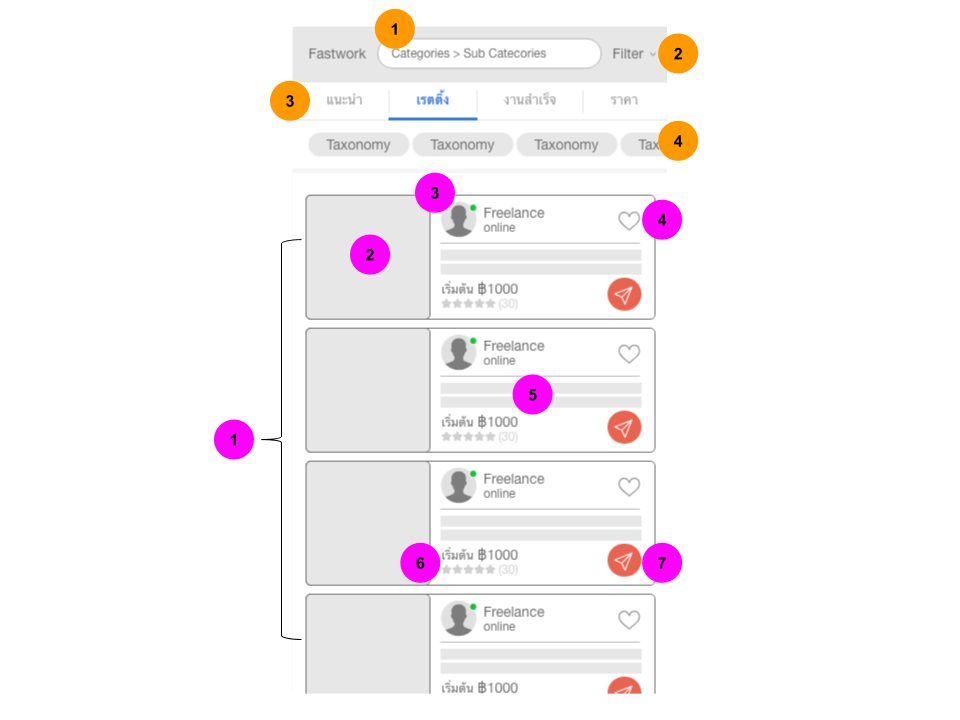
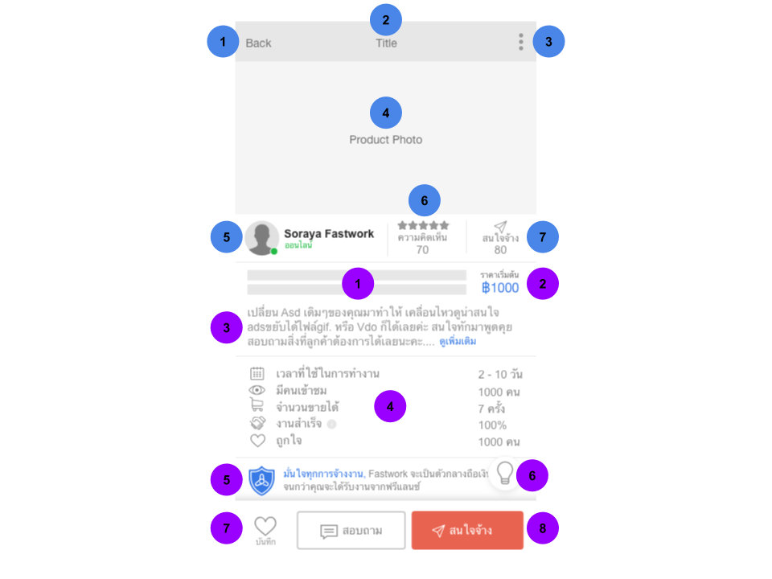

  

# { "developer": "Mobile Engineer (Native)" } to Fastwork

Objective of this challenge is to evaluate your domain in **Mobile application development (Swift or Kotlin)**, that is, its organization, style and good practices with the code, creation of application, knowledge of the frameworks and technologies used.

## Rules

1. Please organize, design, test, document and share your app, then send us a link to the hosted repository (e.g. Github, Bitbucket...).

2. Develop the project using:
    - **Swift or Kotlin**

3. Submit the link of your repository with the challenge code until **10 days** after its application.

## The challenge

Here is the layout and description that should be produced:

**Create product list page.**

 

Create header, tab bar, taxonomy filters.
1. Search bar [text field] (no action).
2. Filter button (click to show blank popup).
3. Tab bar sorting (click to change active tab and show alert sorting name).
4. Tag bar [button group] (have 5 tag can slide and each button tag no action).

Create list item.
1. Product list (each list click to product detail).
2. Cover photo [image] (use field `photos[].is_cover_photo = true`)
3. Profile photo [image] (use field `user.image`), Username (use field: `user.first_name`), Badge and text "online" (alway show).
4. Favorite button (click to change active stage).
5. Product title (use field `title` and limit 2 row).
6. Product price (fix text "฿1000"), Rating (use field `rating`), Number rating (use field `purchase`).
7. Send message button (no action).

> Product list data get from this api http://www.mocky.io/v2/5b0275b83000007500cee151

 

**Create product detail page.**

 

Create detail section top
1. Back button (click to back to product list).
2. Title (use field `title` and show only 1 row).
3. More button (no action).
4. Photo slide (use field `photos[]`, auto slide, swipe and click to show full screen).
5. Profile photo [image] (use field `user.image`), Username (use field: `user.first_name`), Badge and text "online" (alway show).
6. Rating (use field `rating`), Number rating (use field `purchase`).
7. Fix layout and text.

Create detail section bottom
1. Product title (use field `title` and limit 2 row).
2. Product price (fix text "฿1000").
3. Product description (use field `description`, limit 3 row and can click more button to expand all description).
4. Fix layout and text.
5. Shield (no action and use image below).
6. Not show this icon.
7. Favorite button (click to change active stage).
8. Chat and send meassage button (click to show blank popup).

> Product detail data get from same api above

 

### Some tips and remarks

> Note 1: Feel free to use any 3rd party, be it for graphics, tests, etc;

> Note 2: Consider that all fields are mandatory in the form.

> Note 3: Consider validating the fields also in the API and in case of inconsistency return error in a structured JSON with HTTP 400 code

## Readme

Write your README as if it was for a production service. Include the following items:

* Description of the problem and solution.
* Whether the solution focuses on back-end, front-end or if it's full stack.
* Reasoning behind your technical choices, including architectural.
* Trade-offs you might have made, anything you left out, or what you might do differently if you were to spend additional time on the project.

## How we review

Your application will be reviewed by the CTO and at least one senior engineer. We do take into consideration your experience level.

**We value quality over feature-completeness**. It is fine to leave things aside provided you call them out in your project's README. The goal of this code sample is to help us identify what you consider production-ready code. You should consider this code ready for final review with your colleague, i.e. this would be the last step before deploying to production.

The aspects of your code we will assess include:

* **Architecture**: how clean is the separation between the front-end and the back-end?
* **Clarity**: does the README clearly and concisely explains the problem and solution? Are technical tradeoffs explained?
* **Correctness**: does the application do what was asked? If there is anything missing, does the README explain why it is missing?
* **Code quality**: is the code simple, easy to understand, and maintainable?  Are there any code smells or other red flags? Does object-oriented code follows principles such as the single responsibility principle? Is the coding style consistent with the language's guidelines? Is it consistent throughout the codebase?
* **Security**: are there any obvious vulnerability?
* **Testing**: how thorough are the automated tests? Will they be difficult to change if the requirements of the application were to change? Are there some unit and some integration tests?
	* We're not looking for full coverage (given time constraint) but just trying to get a feel for your testing skills.
* **UX**: is the web interface understandable and pleasing to use? Is the API intuitive?
* **Technical choices**: do choices of libraries, databases, architecture etc. seem appropriate for the chosen application?

Bonus point (those items are optional):

* **Scalability**: will technical choices scale well? If not, is there a discussion of those choices in the README?
* **Production-readiness**: does the code include monitoring? logging? proper error handling?

## Doubts

Send your questions directly to [ben@fastwork.co](mailto:ben@fastwork.co) and cc to [burin@fastwork.co](mailto:burin@fastwork.co).